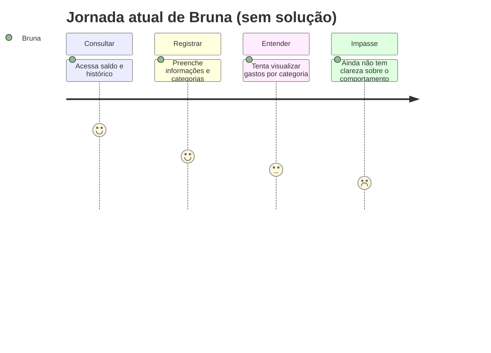
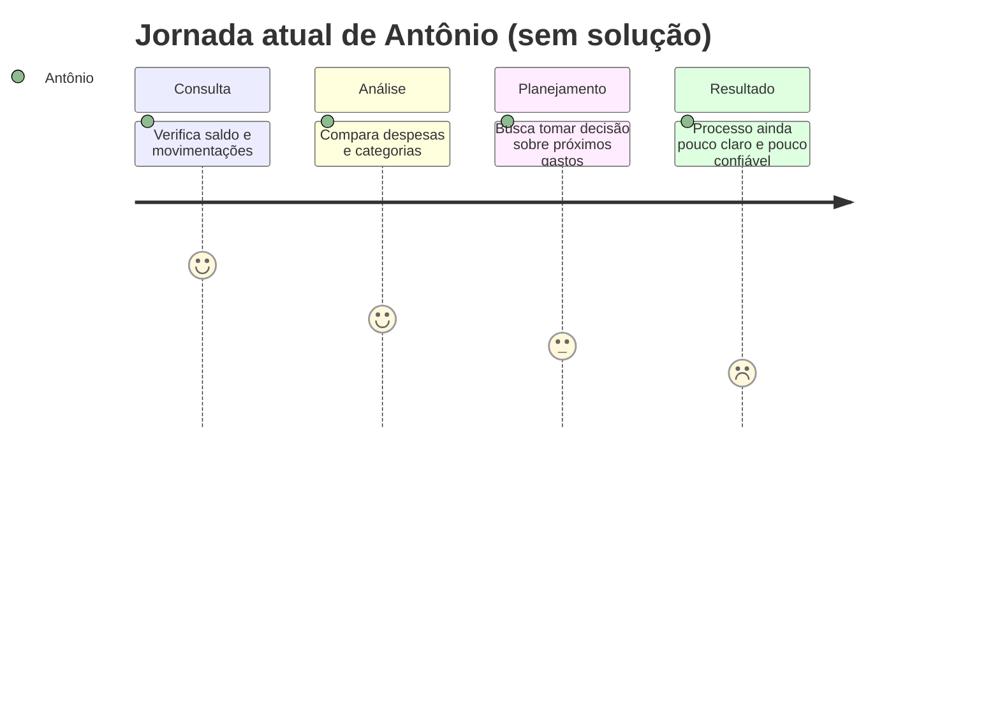

# Cenário de análise/problema

## 1) Cenário de análise/problema — Bruna

Bruna trabalha durante o dia e termina a faculdade com uma rotina apertada. No seu cotidiano, ela precisa acompanhar pequenas compras, alimentação, transporte e cartões, mas acaba usando o aplicativo do banco como referência principal para perceber o que está gastando. Quando tenta controlar suas despesas, percebe que o processo é cansativo: o registro exige muitas etapas, a visualização do saldo e dos gastos é pouco clara e ela precisa preencher informações repetidas para manter tudo organizado.

Mesmo com a vontade de controlar melhor o dinheiro, Bruna sente que o processo de acompanhamento financeiro não é simples e acaba deixando de registrar algumas movimentações. Isso gera frustração, porque ela quer entender para onde o dinheiro está indo sem precisar gastar muito tempo em tarefas mecânicas.

## 2) Questões de refinamento — Bruna

- Por que Bruna não registra todas as despesas do dia a dia?
- O problema acontece sempre ou apenas em momentos de maior pressão financeira?
- Ela busca apenas organização ou também entende melhor o impacto dos gastos no mês?
- O que ela já tentou para controlar melhor o dinheiro?
- Quais informações são mais importantes para ela consultar rapidamente?

## 3) Refinamento do cenário — Bruna

Bruna precisa acompanhar seu dinheiro de maneira prática, mas enfrenta dificuldades para registrar e interpretar suas despesas. Como trabalha durante o dia e vive uma rotina acelerada, ela prefere soluções rápidas e de leitura direta. Quando o processo exige muita informação ou etapas repetitivas, ela abandona a organização financeira e passa a consultar apenas o saldo, sem entender a distribuição dos gastos. Isso gera uma sensação de falta de controle e dificulta a tomada de decisão no dia a dia.

## 4) Contexto de uso — Bruna

- Bruna usa principalmente o celular em momentos rápidos do dia, como ao final do trabalho ou durante pequenos intervalos.
- Ela está em contato com aplicativos bancários, faturas e pequenas despesas frequentes.
- O contexto social e econômico dela exige praticidade, organização e leitura rápida dos dados.
- A ferramenta deve ser usada em contexto de mobilidade, com interface simples e acessível.
- O problema principal surge quando ela tenta registrar ou entender gastos sem perder tempo.

## 5) Jornada do usuário atual — Bruna

| Etapa | O que acontece | Estado emocional |
| :---- | :---- | :---- |
| 1. Percebe a necessidade de controle | Bruna identifica que o dinheiro está saindo sem uma visão clara. | Preocupada |
| 2. Acessa o aplicativo ou o banco | Ela consulta o saldo e tenta acompanhar o panorama financeiro. | Insegura |
| 3. Registra despesa | O processo exige muitos campos e etapas repetitivas. | Frustrada |
| 4. Visualiza os gastos | Ela tenta entender onde o dinheiro está indo, mas as informações não são claras. | Cansada |
| 5. Conclui a tarefa | Bruna consegue acompanhar apenas superficialmente o financeiro, sem uma visão completa. | Insatisfeita |

---

## Cenário de análise/problema — Antônio

Antônio é um profissional autônomo com uma rotina de finanças mais variável. Ele precisa acompanhar contas, cartão, despesas do dia a dia e também pensar no planejamento dos próximos meses. Em algumas situações, ele encontra as informações espalhadas em diferentes canais e percebe que não consegue entender com clareza como suas decisões impactam o planejamento financeiro. Ele quer ter uma visão mais objetiva de seus gastos, mas encontra dificuldade em registrar e interpretar os dados sem que o processo se torne demorado ou confuso.

O problema para Antônio não é apenas saber o quanto ele gastou, mas entender como esses gastos influenciam sua organização e os próximos objetivos financeiros.

## Questões de refinamento — Antônio

- Ele consegue acompanhar as finanças com regularidade ou somente em períodos de planejamento?
- O que mais o incomoda: registrar, visualizar ou interpretar os dados?
- Quais informações são essenciais para ele tomar decisões?
- Ele precisa de previsibilidade, controle ou organização?
- Quais são os principais momentos em que ele busca informação financeira?

## Refinamento do cenário — Antônio

Antônio precisa de um panorama mais organizado das suas finanças para planejar melhor os próximos gastos. No entanto, a forma como ele hoje acompanha o orçamento não oferece clareza suficiente para interpretar o impacto dos seus gastos ao longo do tempo. Isso o leva a consultar o saldo e o histórico de movimentações, mas sem uma visão sólida sobre como seu comportamento financeiro está influenciando o planejamento geral. O problema central está na dificuldade de organizar e interpretar dados dispersos.

## Contexto de uso — Antônio

- Antônio costuma consultar suas finanças em casa ou em momentos de planejamento financeiro.
- Ele busca entender o saldo, analisar despesas por categoria e comparar períodos.
- O contexto é profissional e exige mais observação econômica, organização e previsibilidade.
- A ferramenta deve suportar decisões de planejamento, não apenas o registro de transações.
- O problema surge quando o usuário precisa interpretar dados sem perder tempo ou ter uma visão fragmentada.

## Jornada do usuário atual — Antônio

| Etapa | O que acontece | Estado emocional |
| :---- | :---- | :---- |
| 1. Necessidade de análise | Antônio percebe que precisa revisar a situação financeira antes de gastar mais. | Preocupado |
| 2. Consulta o saldo | Ele verifica quanto possui e tenta entender a situação atual. | Confiante |
| 3. Analisa despesas | Ele tenta verificar categorias e histórico, mas há dispersão de dados. | Inseguro |
| 4. Planeja os próximos gastos | Ele busca decidir com mais autonomia, mas sente dificuldade na análise. | Frustrado |
| 5. Tomada de decisão | A percepção final fica limitada pela ausência de uma visão clara e simples. | Insatisfeito |

## Conclusão

Os cenários evidenciam que o problema central do projeto não está apenas no registro de gastos, mas na forma como as informações financeiras são organizadas, interpretadas e empregadas no cotidiano. A solução deverá permitir que o usuário compreenda melhor sua situação financeira com menos esforço e maior clareza.
