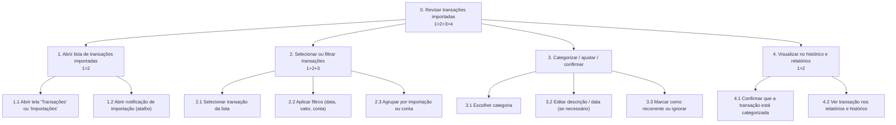
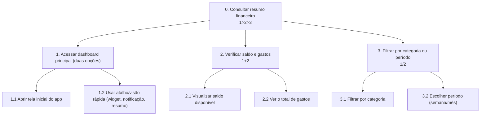

# Análise de tarefas

A análise de tarefas do projeto Organize foi estruturada a partir das necessidades identificadas na pesquisa com usuários, no perfil do usuário e nas personas descritas em [2_pesquisa_usuarios.md](2_pesquisa_usuarios.md), [3_perfil_usuario.md](3_perfil_usuario.md) e [4_personas.md](4_personas.md). O objetivo é modelar como o usuário interage com a aplicação, com foco em rapidez, simplicidade e clareza na leitura das informações financeiras. Observação importante: o aplicativo integra-se com a API de Open Finance para importar automaticamente transações bancárias — o usuário não cadastra gastos individualmente em nenhum momento; sua ação principal é revisar, categorizar ou ajustar transações importadas.

## 1) HTA — Revisar e categorizar transações importadas

**Funcionalidade**: devido à integração com a API de Open Finance, as transações são importadas automaticamente; o usuário não cadastra gastos individualmente. O fluxo principal consiste em revisar, categorizar e, quando necessário, ajustar ou excluir transações importadas.



- **Plano 0 (1>2>3>4)**: transações são importadas, o usuário abre a lista, seleciona e categoriza/ajusta, e confirma a visualização nos relatórios.
- **Plano 1 (1>2)**: o usuário pode acessar a lista de importações via a tela de transações ou via uma notificação/atalho de importação.
- **Plano 2 (1+2+3)**: selecionar, filtrar e categorizar podem ocorrer em ordem flexível, mas a categorização é o objetivo central.

### Explicação da funcionalidade

Com a integração Open Finance, a necessidade de digitar cada gasto desaparece. O foco da experiência é reduzir o atrito na revisão das importações, oferecer categorização rápida e sugestões automáticas, e permitir ajustes mínimos quando necessário. Esse fluxo atende principalmente à Bruna, que prioriza agilidade.

---

## 2) HTA — Consultar saldo e gastos por categoria

**Funcionalidade**: permitir ao usuário acessar rapidamente o saldo atual, visualizar seus gastos e entender como o dinheiro está sendo distribuído por categoria. O HTA deixa explícito que há pelo menos duas formas de acesso ao resumo financeiro (ex.: abrir o app ou usar um atalho/visor rápido), oferecendo caminhos alternativos de entrada.



- **Plano 0 (1>2>3)**: o usuário acessa o resumo por qualquer uma das duas rotas disponíveis, verifica os dados e aplica filtros se desejar.
- **Plano 2 (1+2)**: saldo e gastos são apresentados no mesmo painel, com destaque para a distribuição por categoria.
- **Plano 3 (1/2)**: o usuário pode alternar entre visão por categoria e visão por período.

### Explicação da funcionalidade

Essa tarefa representa a necessidade de Antônio, persona primária do projeto, de interpretar o comportamento financeiro de forma clara e objetiva. Garantir múltiplos pontos de entrada para o dashboard melhora a rapidez de acesso e a adaptação a diferentes cenários de uso (abrir app versus checar um resumo rápido).

---

## 3) GOMS — Revisar e categorizar transações importadas

**Funcionalidade**: revisar transações importadas automaticamente via Open Finance, categorizá-las e aplicar ajustes mínimos.

```text
GOAL 0: revisar e categorizar transações importadas

  GOAL 1: acessar lista de transações importadas
    METHOD 1.A: abrir aplicativo
      OP. 1.A.1: abrir app (tela inicial)
    METHOD 1.B: usar atalho/visor rápido
      OP. 1.B.1: abrir resumo via widget/atalho ou notificação

  GOAL 2: selecionar transação para revisão
    METHOD 2.A: pesquisar/filtrar
      OP. 2.A.1: aplicar filtro por data/conta/valor
      OP. 2.A.2: tocar na transação

  GOAL 3: categorizar ou ajustar
    METHOD 3.A: usar sugestão automática ou escolher manualmente
      OP. 3.A.1: aceitar sugestão de categoria
      OP. 3.A.2: editar categoria/descrição se necessário
      OP. 3.A.3: marcar como repetitiva/ignorar

  GOAL 4: confirmar e visualizar
    METHOD 4.A: salvar alteração
      OP. 4.A.1: confirmar alteração
      OP. 4.A.2: verificar presença no histórico/relatório
```

### Explicação do GOMS

O GOMS foi adaptado para refletir que as transações chegam pela integração Open Finance. O papel do usuário é revisar e confirmar categorização — não inserir dados financeiros manualmente. Foram adicionadas duas formas de acessar a lista de transações (abrir app ou usar atalho/visão rápida) para manter alternativas de entrada no fluxo.

---

## 4) GOMS — Visualizar resumo financeiro

**Funcionalidade**: consultar o saldo e entender onde o dinheiro está sendo gasto. Incluir pelo menos duas formas de acessar o dashboard para refletir diferentes hábitos de uso.

```text
GOAL 0: consultar o resumo financeiro

  GOAL 1: abrir o dashboard principal
    METHOD 1.A: acessar a tela inicial
      OP. 1.A.1: abrir o aplicativo
      OP. 1.A.2: navegar para o dashboard
    METHOD 1.B: usar atalho/visão rápida
      OP. 1.B.1: abrir resumo via widget/atalho

  GOAL 2: interpretar as informações principais
    METHOD 2.A: analisar saldo e gastos
      OP. 2.A.1: localizar o saldo disponível
      OP. 2.A.2: localizar o total de gastos
      OP. 2.A.3: observar os gráficos de categoria
      OP. 2.A.4: comparar o valor por categoria

  GOAL 3: aplicar filtro opcional
    METHOD 3.A: filtrar por período
      OP. 3.A.1: tocar no filtro de período
      OP. 3.A.2: selecionar semana ou mês
      OP. 3.A.3: confirmar a visualização
```

### Explicação do GOMS

O modelo enfatiza múltiplos pontos de entrada para o dashboard (abrir app ou usar um atalho/visão rápida). Isso garante que o usuário possa consultar rapidamente o resumo financeiro ou realizar uma revisão mais detalhada ao abrir o aplicativo completo.

---

## 5) GOMS — Criar uma meta de economia

**Funcionalidade**: permitir que o usuário defina uma meta financeira para guardar valor em um período específico.

```text
GOAL 0: criar uma meta de economia

  GOAL 1: acessar a área de metas
    METHOD 1.A: abrir a seção de objetivos
      OP. 1.A.1: tocar na aba "Metas"
      OP. 1.A.2: selecionar "Nova meta"

  GOAL 2: configurar a meta
    METHOD 2.A: preencher dados da meta
      OP. 2.A.1: definir o nome da meta
      OP. 2.A.2: inserir o valor desejado
      OP. 2.A.3: escolher o prazo
      OP. 2.A.4: confirmar a criação

  GOAL 3: acompanhar progresso
    METHOD 3.A: verificar status da meta
      OP. 3.A.1: abrir a meta criada
      OP. 3.A.2: observar o progresso atual
      OP. 3.A.3: verificar quanto ainda falta para atingir o objetivo
```

### Explicação da funcionalidade

A meta de economia está diretamente ligada à necessidade de planejamento financeiro observada em Antônio. A funcionalidade permite transformar o acompanhamento financeiro em algo mais estratégico, ajudando o usuário a manter foco em objetivos e a acompanhar seu progresso ao longo do tempo.

---

## Conclusão

A análise de tarefas demonstrou que as funcionalidades centrais do projeto Organize estão relacionadas a três pilares: rapidez no registro, clareza na leitura de dados e apoio ao planejamento financeiro. A partir dos modelos HTA e GOMS, fica evidente que a interface deve priorizar ações curtas, feedback visual imediato e organização clara das informações, alinhadas às necessidades dos usuários identificadas na pesquisa e nas personas.
