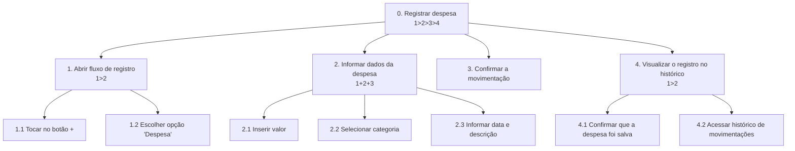
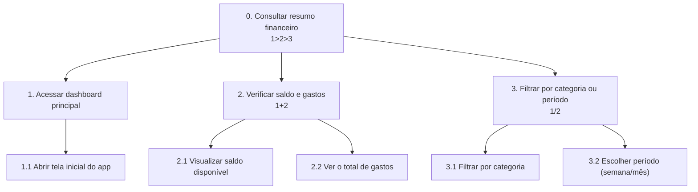

# Análise de tarefas

A análise de tarefas do projeto Organize foi estruturada a partir das necessidades identificadas na pesquisa com usuários, no perfil do usuário e nas personas descritas em [2_pesquisa_usuarios.md](2_pesquisa_usuarios.md), [3_perfil_usuario.md](3_perfil_usuario.md) e [4_personas.md](4_personas.md). O objetivo é modelar como o usuário realiza as ações mais importantes dentro da aplicação, com foco em rapidez, simplicidade e clareza na leitura das informações financeiras.

## 1) HTA — Registrar uma despesa rápida

**Funcionalidade**: permitir ao usuário registrar uma nova despesa em poucos passos, sem exigir muitos campos ou excesso de informações.



- **Plano 0 (1>2>3>4)**: o usuário abre o registro, informa os dados, confirma e visualiza o item salvo.
- **Plano 1 (1>2)**: primeiro o usuário acessa a ação de registro e depois escolhe o tipo de movimentação.
- **Plano 2 (1+2+3)**: valor, categoria e descrição podem ser preenchidos em qualquer ordem, desde que o usuário conclua todos os campos principais.
- **Plano 4 (1>2)**: a movimentação é salva e, em seguida, o usuário pode consultar o histórico.

### Explicação da funcionalidade

Essa tarefa representa a ação mais crítica para Bruna, persona primária do projeto. A funcionalidade deve permitir que o usuário cadastre um gasto em poucos segundos, reduzindo atrito e evitando a sensação de excesso de preenchimento. Para a jornada de uso, essa etapa está diretamente relacionada à necessidade de agilidade no registro financeiro.

---

## 2) HTA — Consultar saldo e gastos por categoria

**Funcionalidade**: permitir ao usuário acessar rapidamente o saldo atual, visualizar seus gastos e entender como o dinheiro está sendo distribuído por categoria.



- **Plano 0 (1>2>3)**: o usuário entra na tela principal, verifica o resumo e, se necessário, aplica filtros.
- **Plano 2 (1+2)**: saldo e gastos são exibidos no mesmo painel, sem necessidade de navegação extra.
- **Plano 3 (1/2)**: o usuário escolhe entre visualizar por categoria ou por período, não necessariamente os dois ao mesmo tempo.

### Explicação da funcionalidade

Essa tarefa representa a necessidade de Antônio, persona primária do projeto, de interpretar o comportamento financeiro de forma clara e objetiva. A interface deve facilitar a leitura de informações essenciais, como saldo disponível, total de gastos e gastos por categoria, sem sobrecarregar o usuário com excesso de detalhe.

---

## 3) GOMS — Registrar despesa rápida

**Funcionalidade**: concluir o fluxo de cadastro de uma despesa em poucos passos.

```text
GOAL 0: registrar uma despesa

  GOAL 1: abrir o fluxo de cadastro
    METHOD 1.A: usar botão de ação principal
      OP. 1.A.1: tocar no botão "+"
      OP. 1.A.2: selecionar a opção "Despesa"

  GOAL 2: preencher os dados da despesa
    METHOD 2.A: preencher manualmente
      OP. 2.A.1: digitar o valor da despesa
      OP. 2.A.2: escolher a categoria
      OP. 2.A.3: inserir a data
      OP. 2.A.4: escrever uma descrição breve

  GOAL 3: salvar a movimentação
    METHOD 3.A: confirmar o registro
      OP. 3.A.1: tocar no botão "Salvar"
      OP. 3.A.2: verificar que a despesa aparece no histórico
```

### Explicação do GOMS

O método A representa a rotina mais direta para um usuário que deseja registrar um gasto sem perder tempo. O modelo mostra a sequência lógica das operações, reforçando a ideia de simplicidade e rapidez, que foi destacada na pesquisa como característica prioritária na experiência do usuário.

---

## 4) GOMS — Visualizar resumo financeiro

**Funcionalidade**: consultar o saldo e entender onde o dinheiro está sendo gasto.

```text
GOAL 0: consultar o resumo financeiro

  GOAL 1: abrir o dashboard principal
    METHOD 1.A: acessar a tela inicial
      OP. 1.A.1: abrir o aplicativo
      OP. 1.A.2: verificar a tela inicial

  GOAL 2: interpretar as informações principais
    METHOD 2.A: analisar saldo e gastos
      OP. 2.A.1: localizar o saldo disponível
      OP. 2.A.2: localizar o total de gastos
      OP. 2.A.3: observar os gráficos de categoria
      OP. 2.A.4: comparar o valor por categoria

  GOAL 3: aplicar filtro opcional
    METHOD 3.A: filtrar por período
      OP. 3.A.1: tocar no filtro de período
      OP. 3.A.2: selecionar semana ou mês
      OP. 3.A.3: confirmar a visualização
```

### Explicação do GOMS

Este modelo mostra as ações que o usuário realiza para responder uma pergunta simples: “para onde o meu dinheiro está indo?”. O processo enfatiza a importância de telas bem organizadas, gráficos claros e filtros de consulta rápidos, pois esses elementos diretamente atendem às dores observadas em [3_perfil_usuario.md](3_perfil_usuario.md).

---

## 5) GOMS — Criar uma meta de economia

**Funcionalidade**: permitir que o usuário defina uma meta financeira para guardar valor em um período específico.

```text
GOAL 0: criar uma meta de economia

  GOAL 1: acessar a área de metas
    METHOD 1.A: abrir a seção de objetivos
      OP. 1.A.1: tocar na aba "Metas"
      OP. 1.A.2: selecionar "Nova meta"

  GOAL 2: configurar a meta
    METHOD 2.A: preencher dados da meta
      OP. 2.A.1: definir o nome da meta
      OP. 2.A.2: inserir o valor desejado
      OP. 2.A.3: escolher o prazo
      OP. 2.A.4: confirmar a criação

  GOAL 3: acompanhar progresso
    METHOD 3.A: verificar status da meta
      OP. 3.A.1: abrir a meta criada
      OP. 3.A.2: observar o progresso atual
      OP. 3.A.3: verificar quanto ainda falta para atingir o objetivo
```

### Explicação da funcionalidade

A meta de economia está diretamente ligada à necessidade de planejamento financeiro observada em Antônio. A funcionalidade permite transformar o acompanhamento financeiro em algo mais estratégico, ajudando o usuário a manter foco em objetivos e a acompanhar seu progresso ao longo do tempo.

---

## Conclusão

A análise de tarefas demonstrou que as funcionalidades centrais do projeto Organize estão relacionadas a três pilares: rapidez no registro, clareza na leitura de dados e apoio ao planejamento financeiro. A partir dos modelos HTA e GOMS, fica evidente que a interface deve priorizar ações curtas, feedback visual imediato e organização clara das informações, alinhadas às necessidades dos usuários identificadas na pesquisa e nas personas.
